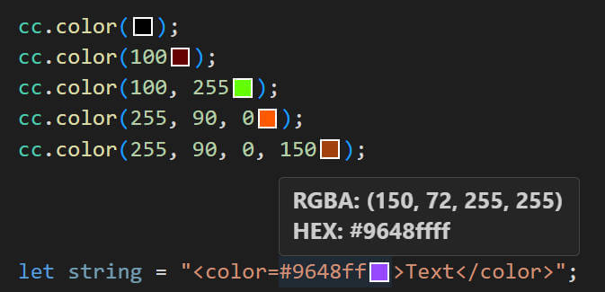
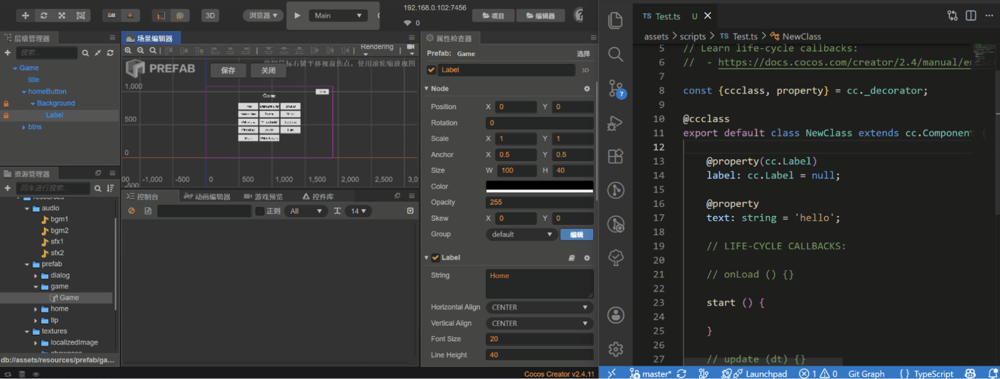

# Cocos Toolbox

一个帮助提升 Cocos Creator 项目一点点开发体验的 VS Code 插件

## 功能特性

### 1) Meta 文件自动同步
- 当你在 VS Code 中对文件或目录执行重命名、移动、删除时，会自动同步对应的 `.meta` 文件。
- 可在设置项 `CocosToolbox.enableMeta` 中启用或关闭。

### 2) 颜色预览与选择
- 识别并预览常见颜色写法，如 `#9648ff`、`#9648ffaa`、`color(255, 90, 0)`。
- 在颜色值旁显示色块，并在悬浮窗口中提供颜色选择器。
- 可在 `CocosToolbox.colorLanguages` 中配置支持语言（默认：`javascript`、`typescript`、`json`）。
- 可在 `CocosToolbox.enableColor` 中启用或关闭。

 

### 3) 一键查找脚本被哪些资源引用
- 快捷键：**<kbd>Ctrl / Cmd</kbd> + <kbd>Alt</kbd> + <kbd>F</kbd>**
- 在右键菜单中快速查找“引用当前脚本”的场景和预制体。
- 在结果面板中点击条目后，会通知 Cocos Creator（支持2.4与3.x版本）打开对应资源。
- 首次使用该功能时，会自动在当前 Cocos Creator 项目的扩展目录安装桥接扩展。
- 由于 Creator 扩展机制，桥接扩展安装后通常需要重启一次 Creator 才会生效。
- 若面板提示“通知失败”，请优先检查：
  - Creator 是否正常运行；
  - 当前打开的是否同一个项目；
  - 项目内桥接扩展是否已正确安装并已重启 Creator 生效。

 

## 配置项
- `CocosToolbox.enableMeta`：是否启用 Meta 自动同步。
- `CocosToolbox.enableColor`：是否启用颜色预览与选择。
- `CocosToolbox.colorLanguages`：颜色预览支持的语言列表。
- `CocosToolbox.creatorOpenAssetTimeout`：通知 Cocos Creator 打开资源的超时时间（毫秒）。
