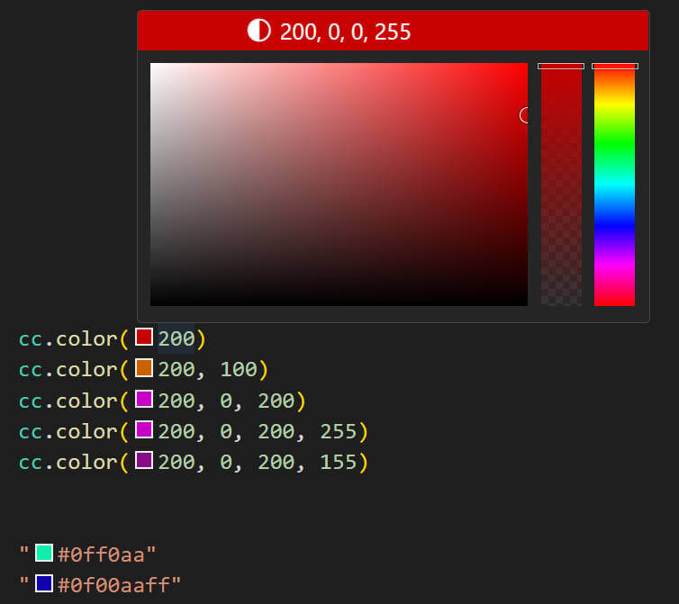
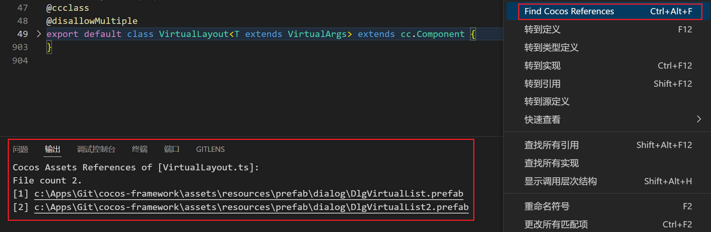

# Cocos Toolbox
一个帮助提升Cocos Creator项目一点点开发体验的VS Code插件

## Features 
- 自动同步meta文件
    - 可在设置中开关 **CocosToolbox.enableMeta**
    - 在VS Code中修改（如重命名、移动、删除）项目文件与目录时，同步修改对应的meta文件

- 颜色预览
    - 可在设置中开关 **CocosToolbox.enableColor**
    - 对文件中形如`#9648ff`和`color(255, 90, 0)`格式的内容旁显示对应的颜色色块
    - 鼠标悬停在以上格式的颜色值时，在悬浮窗上展示颜色编码

     

- 右键菜单快速查找所有引用当前脚本的资源文件（场景和预制体）
    - 快捷键 **<kbd>ctrl(cmd)</kbd>+<kbd>alt</kbd>+<kbd>f</kbd>**

     